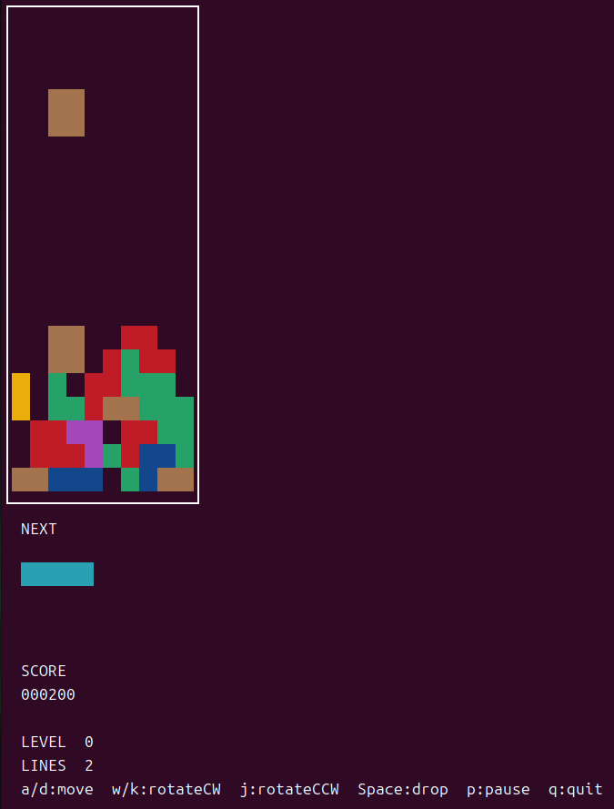

# lean-tetris

Lean 4 で実装したターミナル上で動作するテトリスです。



## 概要

- 10×20 の標準的なテトリスフィールド
- 7 種類のテトロミノ（I・O・T・S・Z・J・L）
- ゴーストピース表示（落下先のプレビュー）
- NEXT ピース表示
- スコア・レベル・ライン数の表示
- レベルが上がるにつれて落下速度が上昇
- ライン消去時のスコア計算（1 ライン: 100、2 ライン: 300、3 ライン: 500、4 ライン: 800 × レベル倍率）
- C FFI によるターミナルの raw モード制御・非ブロッキング入力

ゲームロジックは純粋関数として実装されており、副作用はターミナルの描画と入力読み取りのみに分離されています。

## 操作方法

| キー      | 操作             |
| --------- | ---------------- |
| `a`       | 左移動           |
| `d`       | 右移動           |
| `s`       | ソフトドロップ   |
| `w` / `k` | 時計回りに回転   |
| `j`       | 反時計回りに回転 |
| スペース  | ハードドロップ   |
| `p`       | ポーズ           |
| `q`       | 終了             |

## 動作環境

- **動作確認済み**: Ubuntu 24.04
- **おそらく動作する**: Mac, その他の Linux ディストリビューション（未確認）
- **Windows**: おそらく動作しません。WSL 上であれば動くかもしれません。

ターミナルの raw モード制御に POSIX の `termios` API（C の `tcgetattr` / `tcsetattr`）を使用しているため、Windows ネイティブ環境では動作しません。

## 必要なもの

- **Lean 4**（Lake ビルドシステム含む）
- **C コンパイラ**（gcc または clang）

### Lean 4 のインストール

Lean 4 の公式サイト: https://lean-lang.org/

インストールには公式の `elan`（Lean バージョンマネージャ）を使うのが推奨です。

```bash
curl https://elan.lean-lang.org/elan-init.sh -sSf | sh
```

インストール後、シェルを再起動するか以下を実行してください。

```bash
source ~/.elan/env
```

詳細は [公式ドキュメント](https://docs.lean-lang.org/lean4/doc/setup.html) を参照してください。

## ビルドと実行

```bash
# リポジトリをクローン
git clone https://github.com/your-username/lean-tetris.git
cd lean-tetris

# ビルドして実行
lake exe tetris
```

初回ビルド時は依存関係の解決とコンパイルに数分かかることがあります。

## ライセンス

MIT または Apache License 2.0 のデュアルライセンスです。いずれかを選択して利用できます。

- [LICENSE-MIT](LICENSE-MIT)
- [LICENSE-APACHE](LICENSE-APACHE)

## 実装について

```
lean-tetris/
├── TetrisMain.lean        # エントリポイント・ゲームループ
├── Tetris/
│   ├── Types.lean         # データ型定義（Board・Piece・GameState など）
│   ├── Tetrominoes.lean   # テトロミノの形状・色定義
│   ├── Logic.lean         # ゲームロジック（移動・回転・ライン消去・スコア計算）
│   ├── Render.lean        # ターミナル描画（ANSI エスケープコード）
│   ├── Input.lean         # キー入力読み取り
│   └── FFI.lean           # C FFI 宣言
└── c_src/
    └── terminal.c         # ターミナル制御（raw モード・非ブロッキング入力）
```
